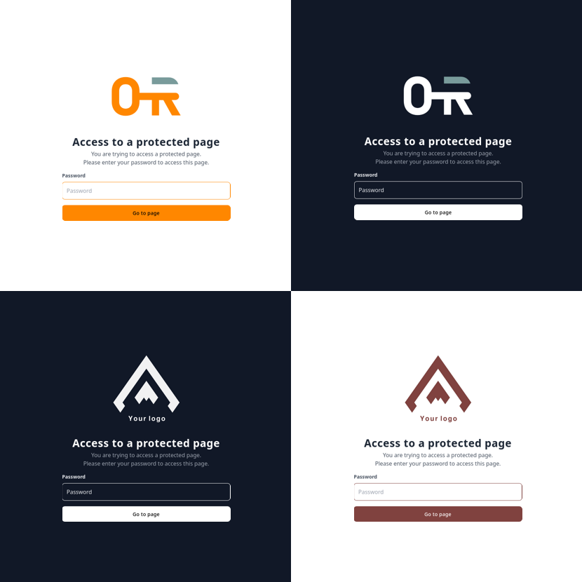

# TYPO3 Extension `page_password` - Protect your pages with a password


## Overview

PagePassword provides a simple way to restrict access to specific pages and their sub-pages with password authentication. This extension allows you to create password-protected sections or entire page trees within your TYPO3 website. Perfect for creating member areas, work-in-progress sections, pre-production environments, or any content that requires basic access control at the page level.

## Features

- 🔒 **Page-level protection**: Secure individual pages and their subpages with custom passwords
- 🛡️ **Easy setup**: Simple configuration through TYPO3 backend
- 🎨 **Customizable**: Flexible styling
- 🌐 **Multi-language support**: Works with TYPO3 localization
- ⚡ **Performance optimized**: Minimal impact on site performance

## Customization
- Enable/disable dark mode
- Choose your own logo for both light and dark mode
- Choose your own primary color for both light and dark mode
- More coming soon...



## What's next?
- ~~Typo3 v14 compatibility~~ see [#437f8a9](https://github.com/rovitch/page_password/commit/437f8a9e25196eaec2218371fde1d0cece46fb04) and [#0223978](https://github.com/rovitch/page_password/commit/022397818ddc18a5c0fb877074d0784d09d7dbcd)
- ~~Enhanced documentation~~ see [#730f45a](https://github.com/rovitch/page_password/commit/730f45a02af87aa5f4e80e230ff4191213f22e78) and [#faa0c44](https://github.com/rovitch/page_password/commit/faa0c4449881fb30b07cf2e0821c7fc1e4ae5463)
- ~~Logging~~ see [#b1397bd](https://github.com/rovitch/page_password/commit/b1397bdf60c0a8a8edc35d6ef9c81d0a873a7917)
- ~~Rate limiter~~ see [#c1ccaef](https://github.com/rovitch/page_password/commit/c1ccaefb6ae3c2f3ca3ff5af65db4e93fb198079)
- Backend module overview
- More customizations

## Requirements

- TYPO3 12.4 LTS or higher
- PHP 8.2 or higher

## Installation

### Via composer
```bash
composer require rovitch/page-password
```
Go to `maintenance` -> `Analyze Database Structure` and apply database changes

## Setup

See [initial setup](Documentation/intital_setup.md)

## Development
```bash
# Install dependencies
make install
```
### Running tests
```bash
# Run all tests
make test
```
```bash
# Run rector and cgl fixes
make fix
```
### Building assets

```bash
# Install dependencies
npm install

# Build css for development
npx tailwindcss -i ./Resources/Private/Css/tailwind.css -o ./Resources/Public/assets/css/main.min.css --watch

# Build css for production
npx tailwindcss -i ./Resources/Private/Css/tailwind.css -o ./Resources/Public/assets/css/main.min.css --minify

# Build typescript
webpack --config webpack.config.js
```
